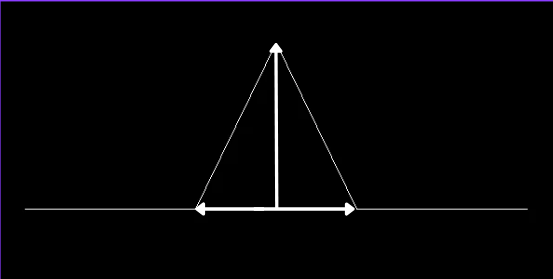

# Fractals
A program that plots fractals using SFML and toml++ for the config

# Setup
Rename example.toml to config.toml, this is the file where you'll configure everything

# Fractal Types

First you have to select a fractal type, the possible options are divided into some categories:

- [Simple Fractals](#simple-fractals)
    - [Simple Tree](#simple-tree)
    - [H Fractal](#h-fractal)
    - [Numeral System Fractal](#numeral-system-fractal)
- [Line Based Fractals](#line-based-fractals)
    - [Koch Patterns](#koch-patterns)

For each fractal the following is listed:

- an explanation
- fractal_type: the string to put in to fractal_type to get the fractal
- other parameters: other parameters used

The general parameters are used for every fractal so they won't be listed.

---

## Simple Fractals

These are some basic fractal patterns, nothing too special.

### Simple Tree

This makes a tree that splits into two new ones every iteration, it represents the binary number system. It perfectly never touches the top of the screen.

fractal_type = "simple tree"

other parameters: none

### H Fractal

This starts with a shape like this |-|, then on every boundary point of the verticals it puts a new shape of the same shape but scaled down/up by **scaling**. 

fractal_type = "h fractal"

other parameters: 
- **scaling**: lower than 1 makes it smaller, bigger than 1 makes every iteration bigger

### Numeral System Fractal

This makes a fractal based on the number system input. Starts with a line pointing up then makes the first iteration according to **num_sys**, 3 means you will have a line at every 120°. Then every iteration it puts this shape at every endpoint of every line but scaled down by **scaling**. The number system represents counting in a different number system than the normal decimal one.

fractal_type = "numeral system"

other parameters:
- **scaling**: lower than 1 makes it smaller, bigger than 1 makes every iteration bigger
- **num_sys**: gives the amount of lines in the first iteration, this should be bigger than 3

---

## Line Based Fractals

These are fractals that work with a base, a line or a shape that only consists, and a model that gets used on every line every iteration. The base is chosen by putting something in **base_preset**, see [Base Preset](#base-preset).

### Base Preset

Here are the possible options for **base_preset** listed:

- "custom" (takes the argument in initial lines)
- "one line"
- "two lines"
- "triangle"
- "sideways triangle"
- "reverse triangle"
- "square"
- "reverse square"
- "rhombus"
- "hexagon"
- "octagon"

If you're using "custom" you have to input something like this in initial_lines:

[
    [[-150, 0], [150, 0]],
    [[150, 0], [-150, 0]]
]

This will generate one line with start point (-150, 0) and end_point (150, 0), and one line with start point (150, 0) and end point (-150, 0). Now a few comments:

1. SFML's positive y-direction is down
2. The order of the lines doesn't matter
3. The order of the points DOES matter, this is because the model of the pattern always works from start point to end point, this will make more sense when actually seeing a model.

### Koch Patterns

These have a triangle as model, the width and height of the triangle will be decided by **line_model_width** and **line_model_height**. The width is a relative positition so 0.5 will put both points in the middle of the line, 1 will put them at the exact ends of the line. For the height it puts the top point above the middle a distance of the height_factor times the length of the line.

fractal_type = "koch"

other parameters:
- **line_model_width**
- **line_model_height**